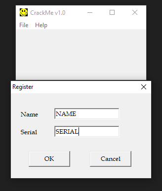
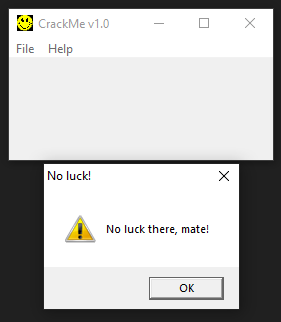
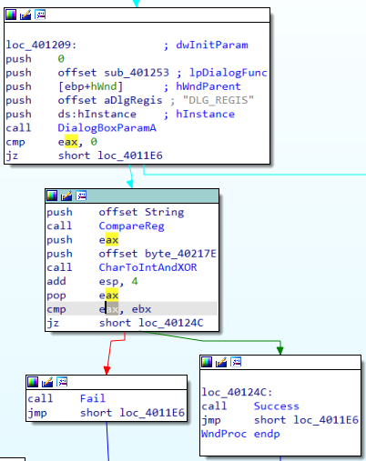
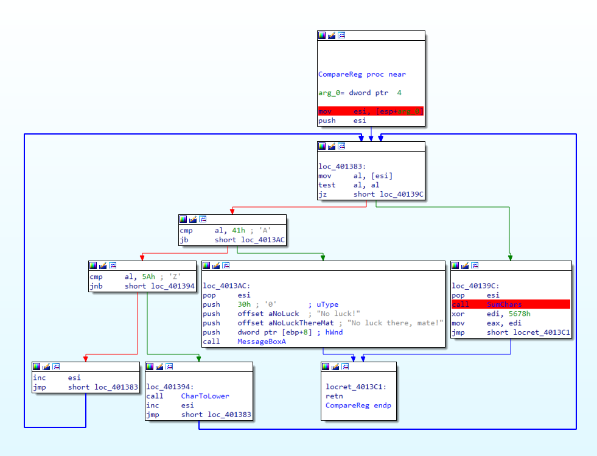
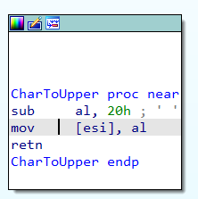
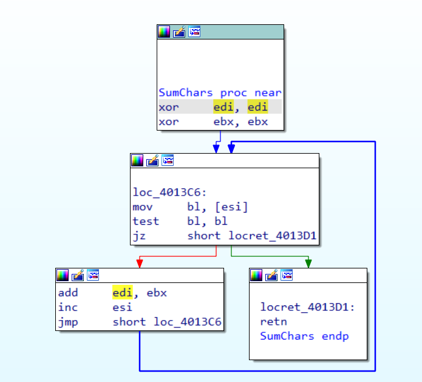

# jamesscrackme by jamesinuk
https://drive.google.com/file/d/1nh9T3FW571IrGeWCJOIOXAQiuSK-dnvL/view

## info
Language: C/C++

Platform: Windows

Arch: x86

## writeup
при запуске появляется окошко с двумя кнопками `File` (где можно только закрыть) и `Help` (где можно пройти регистрацию и посмотреть инфу о crackme)

закономерно получаем ошибку.

открываем отладчик. Видим много различных функций, одна из которых - `WndProc`. Программа явно использует winapi.

часть кода в `WndProc` просто обрабатывает сообщения и реагирует на горячие клавиши, но есть сообщение `DLG_REGIS`.

это, видимо, то что нам надо. Пройдёмся по вызовам функций.

- `CompareReg`

    функция получает какую то строку и перебирает её символы. Если код символа меньше `0x41` (65 в десятич., ASCII - `A`) то выходим.
    Иначе проверяем, больше или равен ли код символа `0x5A` (90 в десятич., ASCII - `Z`). 

    

    если да, то вызывается функция `CharToUpper`.
    Функция вычитает из кода символа 32 и возвращает полученное значение. То есть он таким способом преобразует символ в нижний регистр.

    

    далее код переходит к следующему символу.

    как только цикл натыкается на нулевой символ (конец строки), то он прекращается.
    Код идёт дальше и вызывает `SumChars`.
    Функция просто складывает коды символов из строки и возвращает сумму.

    

    а после полученную сумму *ксорят* с константой `0x5678`. **Запомнили это.**

Далее код сохраняет результат в стеке, пушит `byte_40217E` и вызывает `CharToIntAndXOR`

- `CharToIntAndXOR`

    функция также получает строку (уже другую) и перебирает её символы. Перед началом цикла он записывает `0x0A` (10 в десятич.) в `AL`

    от каждого символа вычитается `0x48`. Судя по всему, он преобразует символ цифры в его числовое значение.
    После этого умножает `EDI` и `EAX` (где у нас лежит число 10), и прибавляет полученное ранее число.

    далее код *ксорит* полученный результат с константой `0x1234` и сохраняет результат в `EBX`. **Также запомнили это.**

после код достаёт из стека результат фунции `CompareReg` и сравнивает с `EBX`, куда функция `CharToIntAndXOR` положил результат своей работы. 
Хитро, однако. Если они равны - успех. Иначе фейл.
